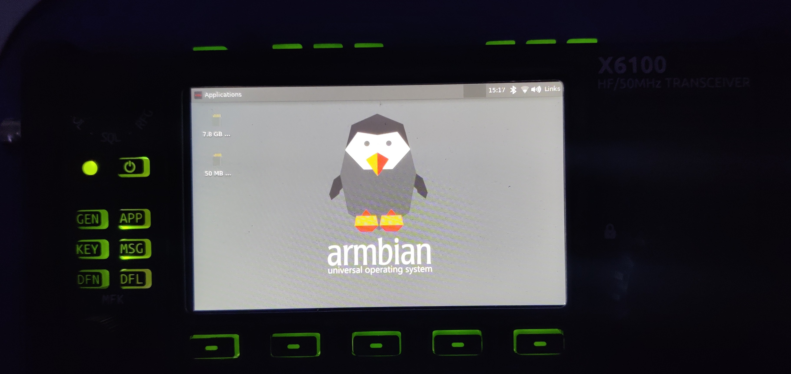

# x6100-armbian
tools and scripts to build armbian for the x6100

THE SOFTWARE IS PROVIDED "AS IS", WITHOUT WARRANTY OF ANY KIND, EXPRESS OR IMPLIED, INCLUDING BUT NOT LIMITED TO THE WARRANTIES OF MERCHANTABILITY, FITNESS FOR A PARTICULAR PURPOSE AND NONINFRINGEMENT. IN NO EVENT SHALL THE AUTHORS OR COPYRIGHT HOLDERS BE LIABLE FOR ANY CLAIM, DAMAGES OR OTHER LIABILITY, WHETHER IN AN ACTION OF CONTRACT, TORT OR OTHERWISE, ARISING FROM, OUT OF OR IN CONNECTION WITH THE SOFTWARE OR THE USE OR OTHER DEALINGS IN THE SOFTWARE.



# requirements
- SD card updade image
- access to the x6100 (or a way to extract files form the update image)

# VNC

after armbian init setup, a VNC server will be running on port 5900 powerd by lightdm.

Note:
the bad build in WiFi Antenna can make a VNC connection Instable very fast.

# WiFi / Network config

on the comand line use `nmtui` or use the Network Manager UI after login.

# build steps

## extract uboot:
```sh
dd if=X6100-sdcard-20220219.img of=uboot_sdcard.bin bs=1024 skip=8 count=512 seek=0
```

## extract kernel and kernel modules
we need:
- zImage
- sun8i-r16-x6100.dtb
- kernel moduels found in /lib/modules/5.8.9

put the files to /userpatches/overlay/extracted

example:
```
└── userpatches
    └── overlay
...
        ├── extracted
        │   ├── modules
        │   │   └── 5.8.9
        │   │       ├── kernel
        ...........
        │   │       ├── modules.alias
        │   │       ├── modules.alias.bin
        │   │       ├── modules.builtin
        │   │       ├── modules.builtin.bin
        │   │       ├── modules.builtin.modinfo
        │   │       ├── modules.dep
        │   │       ├── modules.dep.bin
        │   │       ├── modules.devname
        │   │       ├── modules.order
        │   │       ├── modules.softdep
        │   │       ├── modules.symbols
        │   │       └── modules.symbols.bin
        │   ├── sun8i-r16-x6100.dtb
        │   └── zImage
```


## build armbian:
```sh
git clone https://github.com/armbian/build --depth=1
cp -r userpatches/ build/

cd build
./compile.sh docker BOARD=lime-a33 BRANCH=current RELEASE=buster BUILD_MINIMAL=no BUILD_DESKTOP=yes KERNEL_ONLY=no KERNEL_CONFIGURE=no DESKTOP_ENVIRONMENT=xfce DESKTOP_ENVIRONMENT_CONFIG_NAME=config_base DESKTOP_APPGROUPS_SELECTED="3dsupport browsers" COMPRESS_OUTPUTIMAGE=sha,gpg,img
```

## install on sdcard

install armbian:
```sh
dd if=output/images/Armbian_22.05.0-trunk_Lime-a33_buster_current_5.15.32_xfce_desktop.img of=/dev/<SDCARD>
```

install uboot:
```sh
dd if=uboot_sdcard.bin of=/dev/<SDCARD> bs=1024 seek=8
```

# booting armbian kernel

Note:
currently the screen driver src is not public, resulting in no screen output.
(kernel/drivers/gpu/drm/panel/panel-jlt4013a-pss.ko)

change:
/userpatches/overlay/boot.cmd

from:
```sh
load ${devtype} ${devnum} ${kernel_addr_r} ${prefix}/zImage_org
```

to:
```sh
load ${devtype} ${devnum} ${kernel_addr_r} ${prefix}/zImage
```

if changed live on the x6100 rebuild:
```sh
mkimage -C none -A arm -T script -d boot.cmd boot.scr
```

# starting radio UI

Using ssh or serial:
```sh
/etc/init.d/lightdm stop
/root/chroot_onboard.sh
/etc/init.d/S99userappstart start
```

# working with the device tree

```sh
dtc -I dtb -O dts sun8i-r16-x6100.dtb > sun8i-r16-x6100.dts

dtc -I dts -O dtb sun8i-r16-x6100.dts > sun8i-r16-x6100.dtb
```

# uboot

## get all gpio

```sh
gpio status -a
```

## get button state

this code checks the buttons below the screen.
number 1 is the left most.

```sh
#set matrix row
gpio clear PG6

if gpio input PE16 ; then
echo 1
elif gpio input PE17 ; then
echo 2
elif gpio input PE11 ; then
echo 3
else
echo none
fi

#reset matrix
gpio input PG6
```
